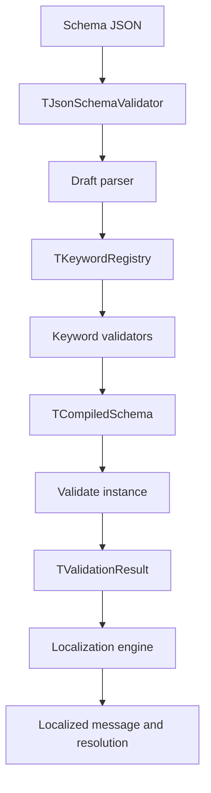

# Architecture

## Overview

JsonSchema Delphi is a keyword-driven JSON Schema validation library.

The current runtime does not use a visitor-based execution model. Instead, schemas are compiled into keyword validator objects and then executed directly against JSON instances.

The design separates the following concerns:

- public validation API
- draft selection and schema compilation
- keyword instantiation and execution
- schema registry and URI resolution
- validation result aggregation
- localized error rendering

## Validation pipeline

The flow is:

1. The public validator receives a schema and an instance.
2. The caller may choose a draft explicitly; the default overload uses Draft 6.
3. The selected draft parser compiles the schema into a compiled schema object.
4. The parser uses a registry of keyword factories to create keyword validators.
5. The compiled schema iterates through all validators and aggregates their results.
6. If validation fails, the active locale translates each error.

## Public entry point

`TJsonSchemaValidator` is the main facade.

It is responsible for:

- selecting the draft parser
- compiling the schema
- validating the instance
- resolving the active locale
- applying localized message and resolution text

The public API stays intentionally small so consumers do not need to understand internal registry, localization, or reference-resolution details.

## Draft model

Supported runtime drafts are:

- Draft 6
- Draft 7
- Draft 2019-09
- Draft 2020-12

Each draft is implemented as an independent parser in `src/Drafts`.

The parsers do not inherit from one another. This keeps draft divergence explicit and avoids a chain such as Draft 2020-12 inheriting Draft 2019-09 inheriting Draft 7.

## Keyword model

Keywords are implemented as separate classes under `src/Keywords`.

The current code groups them by domain:

- `Keywords/Core`
- `Keywords/Validations`
- `Keywords/Logicals`
- `Keywords/Format`
- `Keywords/Metadata`

Every keyword class:

- receives parsed schema data in its constructor
- stores only the constraint data it needs
- validates instances through `Validate`
- exposes a static `CreateKeyword` factory used by the registry

That keeps each keyword local, testable, and easy to reason about.

## Registry and factories

`TKeywordRegistry` maps keyword names to factory delegates.

The current factory model supports:

- keyword value
- parent schema
- compile delegate for nested schemas

That single signature works for simple keywords and complex keywords that need sibling inspection or recursive compilation.

## Compiled schema execution

`TCompiledSchema` stores the compiled keyword validators and runs them in order.

Its responsibilities are deliberately small:

- own the active keyword list
- invoke each keyword validator
- collect each keyword result
- combine all results into one validation result

Boolean schemas are represented through compiled-schema helpers:

- `true` becomes an empty compiled schema
- `false` becomes a compiled schema with an always-failing keyword

## Validation results and metadata

Validation results are represented by `IValidationResult` and `TValidationResult`.

The result model is aggregate-based:

- valid results contain no errors
- invalid results contain one or more errors
- combined results flatten nested failures into one result

Each validation error also carries a JSON context object.

That context stores technical values such as:

- expected values
- actual values
- numeric limits
- pattern text
- property names
- dependency data

This makes localization and diagnostics data-driven.

## Localization

Localization is implemented as a dispatcher engine.

The current runtime supports:

- enUS
- ptBR

`TLocalizationBase` contains the common dispatch logic and maps keyword names to keyword-specific translation methods.
`TLocalizationEngine` resolves the requested locale to the proper localization implementation.

The key design rule is simple: validation logic does not format user-facing messages directly.

## Schema registry and references

`TSchemaRegistry` centralizes schema lookup and reference resolution.

It is responsible for:

- registering schemas by URI
- cloning stored schemas to isolate ownership
- pre-scanning for `$id`, `id`, and `$anchor`
- resolving local and remote schemas
- combining base and relative URIs

### Dynamic Recursion Guard

Rather than utilizing static flags at the keyword instance level, reference resolution (both `$ref` and `$recursiveRef`) relies on `TValidationContext.IsCurrentlyValidating`. During validation, the context maintains a thread-local stack of active schemas, tracking `(SchemaObj, Compiled, Instance)`. A loop is detected only if validation attempts to check the **same schema object** against the **same JSON instance reference**, ensuring complex tree/nested schemas do not cause infinite recursion or premature loop-guard termination.

The registry also keeps global compilation context for the current root schema and base URI so nested references can be compiled without threading that state through every call.

## URI and JSON Pointer subsystem

Reference parsing and JSON Pointer manipulations are managed by a dedicated, RFC-compliant subsystem in `src/Core/URI/`.

For detailed architecture, see the **[URI and JSON Pointer Subsystem Guide](URI-SYSTEM.md)**.

It consists of:

- `TURIReference`: Represents immutable parsed URI components per RFC 3986.
- `TURIUtils`: Helper routines for JSON Pointer segment decoding and encoding, URI normalization, and base-relative resolution.
- `TURIParseResult`: Captures parsing outcomes and component locations.
- `TURIBuilder`: Facilitates programmatically modifying or reassembling URI components.
- `TURIValidator`: Validates absolute/relative URIs and pointer schemas.

This handles `$ref` resolution and identifier management in compliance with standards.

## Draft-aware format validation

Format validation matches target values against semantic constraints using a modularized, draft-aware engine.

For detailed architecture, see the **[Format Validation Subsystem Guide](FORMAT-SYSTEM.md)**.

It consists of:

- `JsonSchema.Keywords.Format.Constants`: Houses all regular expressions, avoiding lines over 140 characters.
- Extracted Validation Units: Focus on specific formats to keep the codebase clean (e.g. `IPv6`, `DateTime`, `Iri`, `UriTemplate`).
- `TFormatRegistry`: Maps standard and custom format validators. Standard formats are mapped to their introduction draft version via a formats map.
- Draft Compliance: Standard formats that are not supported in the active compiler draft version are skipped during validation (validation passes), ensuring strict compliance with specs.

## Evaluation tracking and scope stack

In Draft 2019-09+, keywords like `unevaluatedProperties` and `unevaluatedItems` require dynamic tracking of which parts of the JSON instance have already been validated.

- **`TScope`**: Represents validation scopes. It maps JSON instances to lists of evaluated property names and array item indices.
- **Scope Stack (`FScopeStack` in `TValidationContext`)**: Pushed and popped during validation.
- **Evaluation Merging**: Sibling scopes inside logical combinators (e.g. `allOf`, `anyOf`, `oneOf`) merge their evaluated property/item lists back up to their parent scope upon successful validation, ensuring subsequent evaluation keywords have full visibility of validated elements.

## JSON helper layer

`JsonSchema.JSONHelper` centralizes JSON type guards.

This exists because Delphi JSON type inheritance can make na�ve type checks misleading.

The helper keeps keyword code cleaner and reduces duplicated checks across validators.

## Tests and tooling

The repository also contains supporting tools and regression assets:

- `test` for DUnit projects and schema fixtures
- `tools/Schema2Delphi` for auxiliary generation tasks

Historical fixtures for Draft 3, Draft 4, and draft-next exist for regression coverage, but they must not be treated as confirmed runtime support.

## Confirmed boundaries

- There is no evidence of a public CLI in the repository.
- Compatibility must be maintained draft by draft.
- Translated messages currently exist only for enUS and ptBR.
- Visitor-based execution is not the current runtime model.

## Evolution rule

Architecture changes should preserve compatibility for supported drafts, schema compilation, reference resolution, localized messages, and per-draft tests.

When a future change introduces draft-specific semantic divergence, document the divergence explicitly per draft instead of hiding it behind a shared abstraction.
