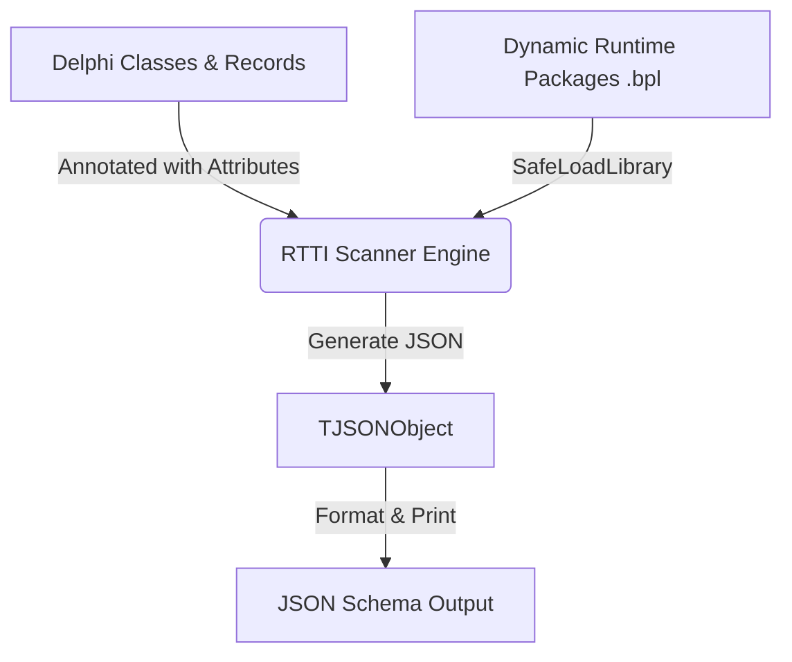

# Delphi2Schema Documentation

Welcome to the **Delphi2Schema** documentation! This tool provides code-to-schema extraction capabilities for JSON Schema in the Delphi ecosystem, helping you maintain a single source of truth for your data models.

## Documentation Index

- ### [API & Command-Line Usage](api/USAGE.md)

  Learn how to use the `Delphi2SchemaCLI` tool to scan compiled Delphi packages (`.bpl`) and classes, use custom schema attributes (like `[JSONSchemaRequired]` or `[JSONSchemaPattern]`), and customize schema extraction settings.

- ### [Development & Setup Guide](development/SETUP.md)

  Guides you on opening, compiling, and running the `Delphi2Schema` project in Delphi Athens (or compatible versions) and modifying the RTTI reflection engine.

- ### [Testing Guide](development/TESTING.md)

  Explains how to compile and execute the unit and integration tests (under the `test/` folder) to verify engine type mappings and CLI commands.

---

## Architectural Diagram

