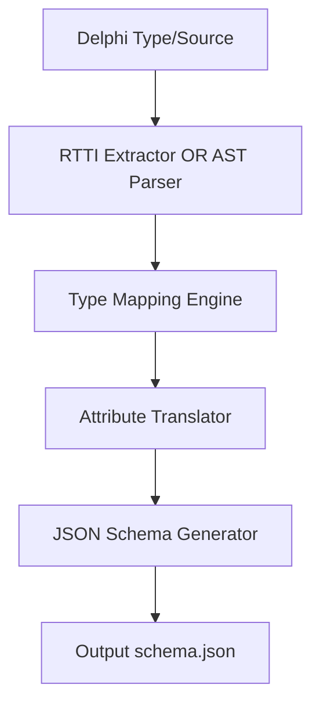

# Delphi2Schema - Architectural Planning

## Overview

`Delphi2Schema` translates Delphi language data models (classes, records, enums) into standard JSON Schema definitions. It supports both static (source code) and dynamic (runtime reflection) metadata extraction.

## Component Architecture

### 1. Extraction Layer

- **Runtime Reflection (RTTI)**: Leverages Delphi's `System.Rtti` context to reflect on classes and records.
- **Static Parser**: Utilizes an AST parsing engine to inspect Pascal units (.pas) and read type definitions without needing a compiled binary.

### 2. Translation & Mapping

- **Type Mapper**: Converts Pascal primitives (`String` -> `string`, `Integer` -> `integer`, `TDateTime` -> `string` with `date-time` format).
- **Attribute Translator**: Scans custom attributes applied to properties/fields to enrich schema constraints (e.g., `[JSONSchemaMinLength(5)]` -> `minLength: 5`).

### 3. Serialization Layer

- Constructs a JSON hierarchy representing the schema and outputs it as a formatted JSON document.
