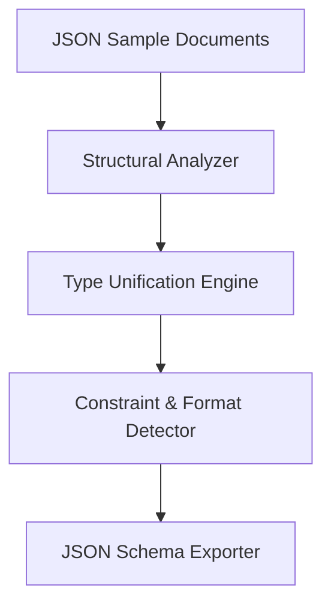

# JSON2Schema - Architectural Planning

## Overview

`JSON2Schema` extracts structure, data types, and value constraints from sample JSON documents to infer a representing JSON Schema.

## Component Architecture

### 1. Structural Analyzer

- Walks the JSON samples to map out key names, object hierarchies, and array types.
- Tracks occurrence counts of properties to decide which keys are required across samples.

### 2. Type Unifier

- If a property holds a string in one sample and null in another, infers a nullable type or optional property.
- Resolves heterogeneous types into type arrays or `anyOf` subschemas.

### 3. Constraint Detector

- Checks string patterns against regular expressions to detect common formats (dates, URIs, UUIDs).
