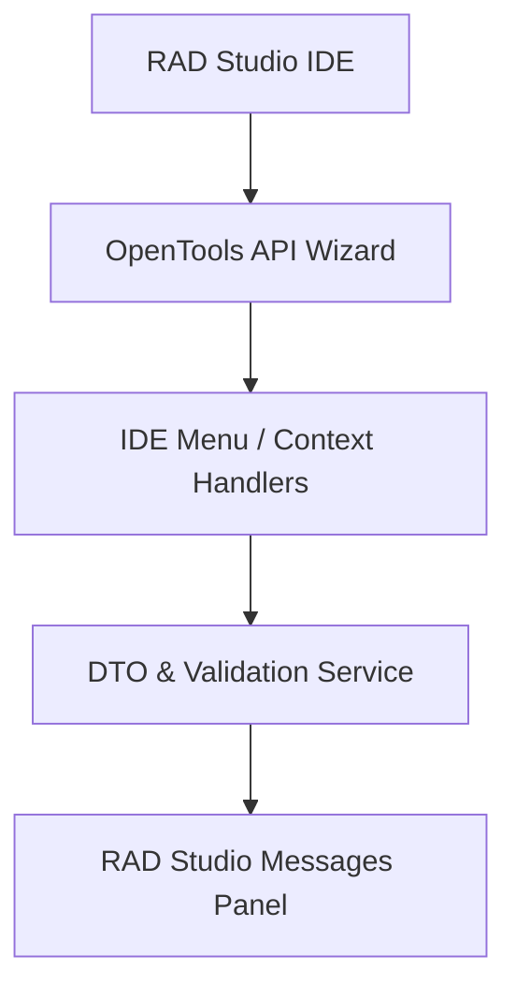

# RADStudioJsonSchemaWizard - Architectural Planning

## Overview

`RADStudioJsonSchemaWizard` integrates our library's tools into the RAD Studio IDE using the OpenTools API (OTA).

## Component Architecture

### 1. OpenTools API Integration

- Compiles as a Delphi package (`.bpl`).
- Registers custom menu items and file context menu actions in the IDE Project Manager.

### 2. Context Handlers

- **Validate Handler**: Resolves the open JSON file editor, validates it, and prints failures in the RAD Studio messages window.
- **Generate DTO Handler**: Executes `Schema2Delphi` on the selected schema file and adds the generated unit to the active project.
