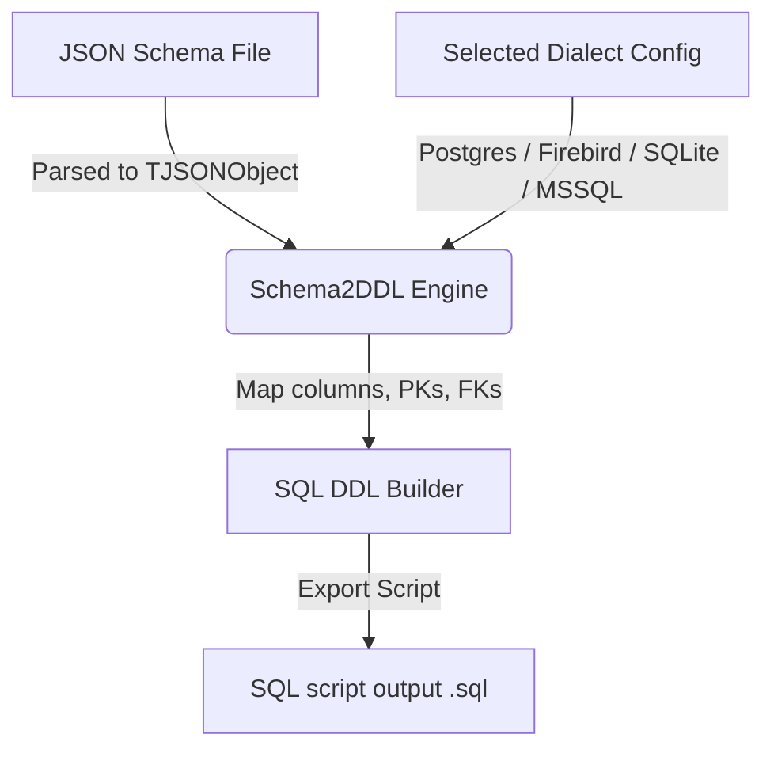

# Schema2DDL Documentation Index

This folder collects the detailed manuals and guides for the **Schema2DDL** tool.

- [API & Command-Line Usage](api/USAGE.md)

  Learn how to run `Schema2DDLCLI.exe` to generate SQL scripts from JSON Schema documents, select dialects, configure table name mappings, and control constraints.

- [Development & Setup Guide](development/SETUP.md)

  Guides you on opening, compiling, and running the `Schema2DDL` project in Delphi Athens (or compatible versions) and modifying the SQL Dialect interfaces.

- [Testing Guide](development/TESTING.md)

  Explains how to compile and execute the unit and integration tests (under the `test/` folder) to verify engine SQL translations against various JSON Schema inputs.

---

## Architectural Workflow

