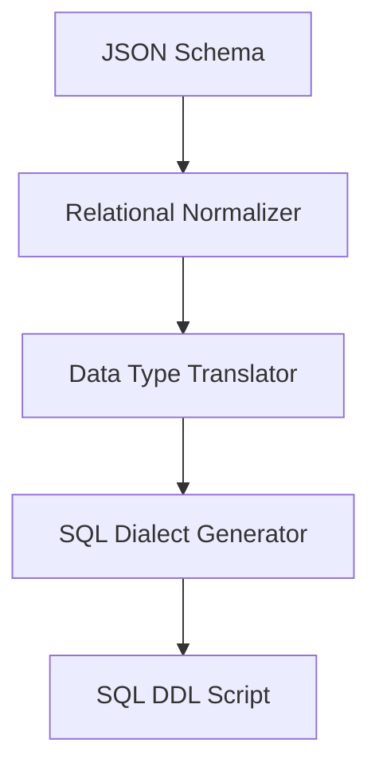

# Schema2DDL - Architectural Planning

## Overview

`Schema2DDL` translates a JSON Schema document into relational database structures, writing equivalent SQL scripts.

## Component Architecture

### 1. Relational Normalizer

- Scans object trees to identify relation bounds.
- Converts nested objects/arrays into relational tables with unique ID primary keys and foreign keys linking back to the parent tables.

### 2. Data Type Translator

- Maps primitive JSON types to SQL equivalents (e.g. `integer` -> `INT` or `BIGINT`, `number` -> `DECIMAL`, `string` -> `VARCHAR`).
- Inspects `maxLength` to size `VARCHAR` fields dynamically.

### 3. Dialect Generator

- Outputs SQL statements conforming to target engine syntax (e.g., PostgreSQL vs Firebird).
