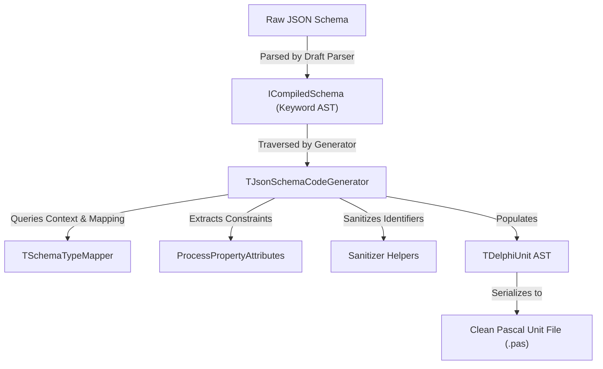

# Component Architecture - Schema2Delphi

`Schema2Delphi` utilizes a compiled-schema AST architecture to translate JSON Schemas into equivalent Pascal structures.

## Processing Pipeline

The generation pipeline avoids direct parsing of raw JSON strings or walking raw JSON structures, instead utilizing the core library's parsing engine to produce a compiled keyword AST.



---

## Modular Components

### 1. Delphi Code AST ([Schema2Delphi.AST.pas](../../src/Schema2Delphi.AST.pas))

Models the target Pascal language constructs in-memory:

- **`TDelphiField`**: Represents class private backing variables (prefixed with `F`).
- **`TDelphiProperty`**: Represents public properties with attributes.
- **`TDelphiEnum`**: Represents custom enumerated types.
- **`TDelphiClass`**: Represents a VCL/FireMonkey class or standard Pascal record structure.
- **`TDelphiUnit`**: Models the complete Pascal source file containing header, interface uses, type declarations, implementation uses, and class definitions.

### 2. Generator Interface & Orchestrator ([Schema2Delphi.Visitor.pas](../../src/Schema2Delphi.Visitor.pas))

- Implements `IGenerationContext` to expose processed class registers and queue mechanisms to other modules.
- Coordinates the traversal using a generation queue to resolve nested objects and `$ref` references sequentially.
- Emits structured Delphi classes and records based on `TGenerationMode`.

### 3. Schema Type Mapper ([Schema2Delphi.TypeMapper.pas](../../src/Schema2Delphi.TypeMapper.pas))

- Evaluates compiled schema keywords (`TRefKeyword`, `TEnumKeyword`, `TItemsKeyword`, `TPropertiesKeyword`, `TTypeKeyword`).
- Resolves schema references ($ref) and enqueues new class targets in the context when nested structures are discovered.
- Maps format fields (e.g. `date-time`, `uuid`) to equivalent Delphi types (e.g. `TDateTime`, `TGuid`).

### 4. Attribute Processor ([Schema2Delphi.AttributeProcessor.pas](../../src/Schema2Delphi.AttributeProcessor.pas))

- Scans JSON validation metadata pairs (e.g. `maxLength`, `minimum`, `pattern`, `readOnly`).
- Emits equivalent Delphi attribute tags (e.g. `[TJsonSchemaMaxLength(10)]`) directly onto property AST instances.

### 5. Code Sanitizer ([Schema2Delphi.Sanitizer.pas](../../src/Schema2Delphi.Sanitizer.pas))

- Sanitizes identifiers to comply with Pascal syntax rules.
- Screens property names against Delphi reserved keywords.
- Implements camelCase to PascalCase converters.

---

## Memory Management

### Destructor Generation

In **gmClass** mode, nested structures are instantiated dynamically inside constructors:

```pascal
constructor TPerson.Create;
begin
  FFriends := TFriends.Create;
end;
```

To prevent memory leaks, `Schema2Delphi` tracks array item types and class attributes, generating explicit heap cleanup loops inside the generated destructor:

```pascal
destructor TPerson.Destroy;
begin
  if Assigned(FFriends) then
  begin
    for var lI := 0 to Length(FFriends) - 1 do
      FFriends[lI].Free;
  end;
  Finalize(FFriends);
  inherited;
end;
```

### Reference Counting

The generator orchestrator (`TJsonSchemaCodeGenerator`) implements `IGenerationContext` as an interfaced object. The entry utilities instantiate the orchestrator as an interface, allowing standard Delphi reference counting to clean up all internal queues and dictionaries automatically without explicit `.Free` statements.
