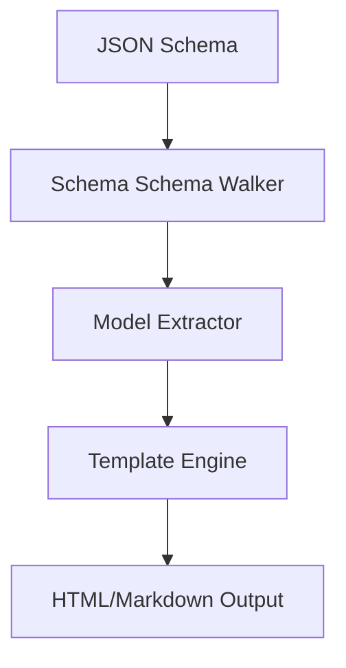

# Schema2Doc - Architectural Planning

## Overview

`Schema2Doc` converts a JSON Schema model into structured documentation using a templating engine.

## Component Architecture

### 1. Model Extractor

- Traverses the schema structures to build a flattened document tree.
- Resolves all local references to display nested types inline or as links.

### 2. Template Renderer

- Uses pre-built templates (Markdown or HTML/CSS) to render documentation sections.
- Formats type constraints cleanly (e.g. `string (min: 5, max: 20)` instead of separate JSON properties).
