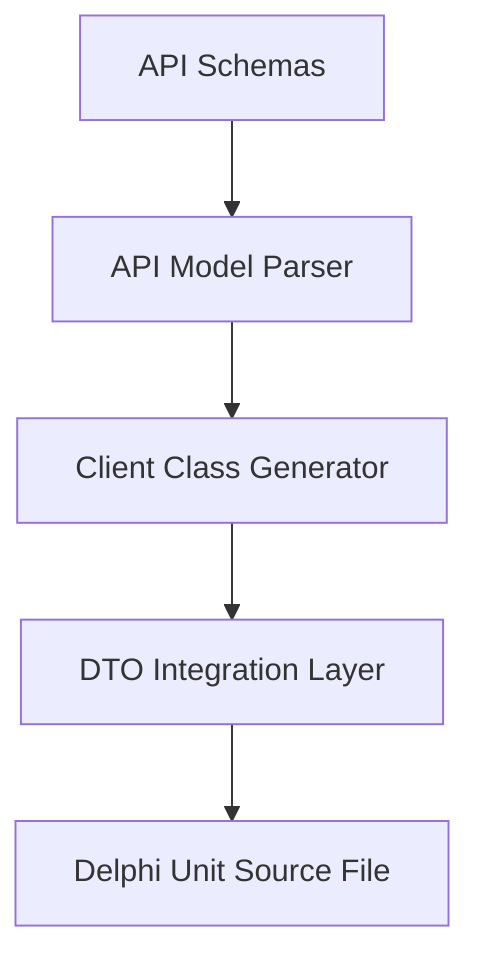

# Schema2REST - Architectural Planning

## Overview

`Schema2REST` translates API structures and request/response JSON Schema payloads into structured Delphi REST Client classes.

## Component Architecture

### 1. API Parser

- Reads API endpoint declarations, request schemas, and response schemas.

### 2. Client Code Generator

- Generates a Delphi class representing the REST service.
- Maps endpoints to class functions (e.g., `GetProduct(ID: Integer): TProductDTO`).
- Writes serialization/deserialization code to handle the request body and parses the response payload.
