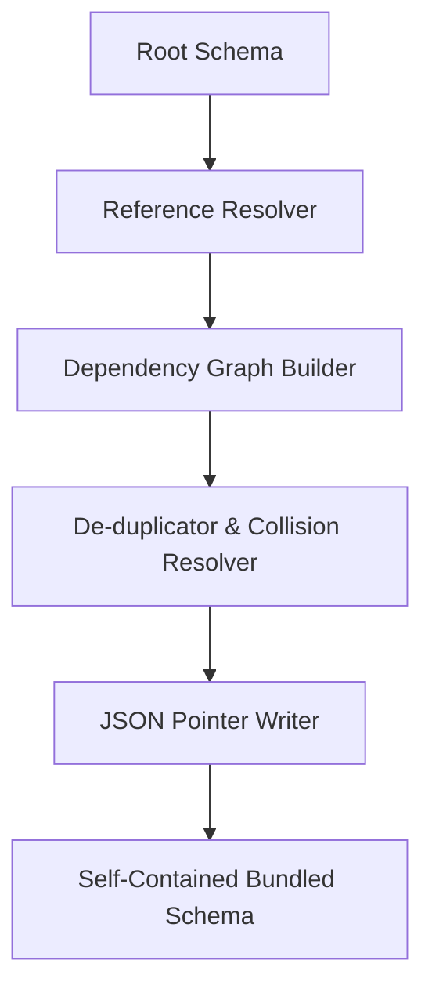

# SchemaBundler - Architectural Planning

## Overview

`SchemaBundler` processes a schema containing external references and packages all referenced schemas into a single, consolidated file.

## Component Architecture

### 1. Dependency Graph Builder
- Recursively parses the input schema.
- Identifies all external `$ref` values (file paths or URLs).
- Fetches and parses remote/local dependency schemas, building a dependency tree.

### 2. Collision Resolver
- Prevents collisions where two external files define a type with the same name (e.g., both have a local anchor `#user`).
- Applies namespace prefixes to unique definitions during inlining.

### 3. JSON Pointer rewriter
- Modifies all `$ref` pointers within the original schema to reference the new inlined locations inside `$defs`.
