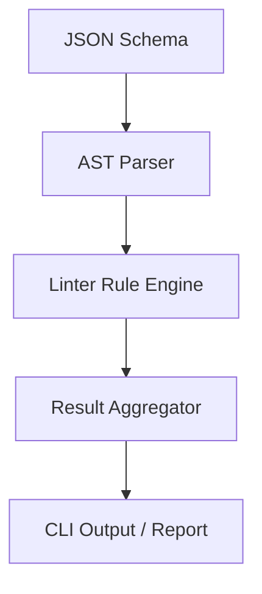

# SchemaLinter - Architectural Planning

## Overview

`SchemaLinter` performs static analysis checks against a JSON Schema AST to identify structural issues, potential runtime bugs, and style violations.

## Component Architecture

### 1. Rule Engine
- Loads standard linter rules:
  - **DeadRefRule**: Verifies all `$ref` targets are reachable.
  - **MetadataMissingRule**: Flags object nodes missing descriptions.
  - **RegexPerformanceRule**: Parses `pattern` regular expressions to detect backtracking risks.
  - **NamingConventionRule**: Enforces PascalCase, camelCase, or snake_case definitions.
