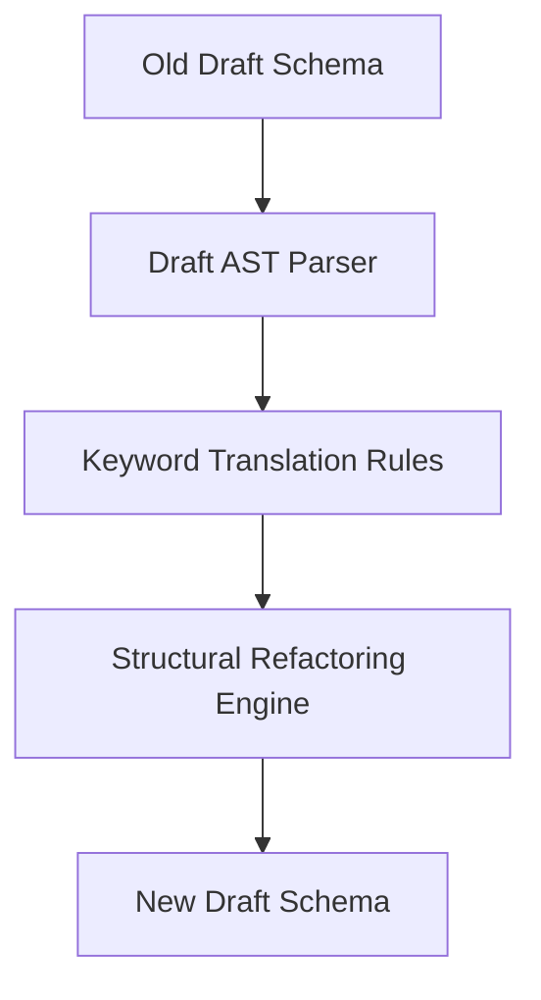

# SchemaMigrator - Architectural Planning

## Overview

`SchemaMigrator` converts JSON Schemas from an older draft syntax to a newer draft version, ensuring compatibility with modern validation engines.

## Component Architecture

### 1. Parser & AST Model
- Parses the input schema and detects the source draft version using the `$schema` keyword or heuristics.
- Builds an AST representation of the schema.

### 2. Migration Rule Pipeline
- Runs draft-specific migration rules:
  - **Draft 4 -> Draft 6**: Update `id` to `$id`, convert boolean schemas.
  - **Draft 7 -> Draft 2019-09**: Rename `definitions` to `$defs`, split `dependencies` into `dependentRequired` and `dependentSchemas`.
  - **Draft 2019-09 -> Draft 2020-12**: Replace `recursiveRef` / `recursiveAnchor` with `dynamicRef` / `dynamicAnchor`.
