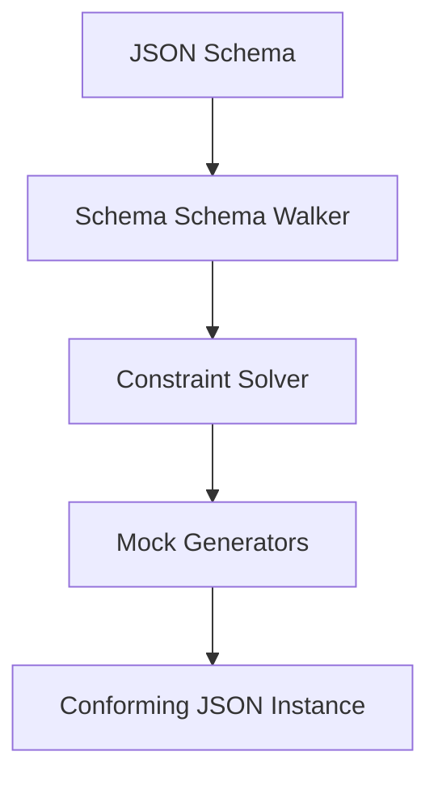

# SchemaMockGen - Architectural Planning

## Overview

`SchemaMockGen` interprets the AST of a compiled JSON Schema and walks its structure, generating conforming random values for each matched keyword validation constraint.

## Component Architecture

### 1. Schema Walker & Solver
- Traverses the compiled schema tree structure.
- Solves overlapping constraints (e.g., when a number must be `> 10` and `< 50`, or strings must match a regex and have length `< 10`).

### 2. Generator Registry
- **String Generators**: Generates regex-conforming strings using reverse-regular-expression generators.
- **Array Generators**: Produces arrays with length within `minItems`/`maxItems` constraints.
- **Object Generators**: Populates required and optional properties, respecting `additionalProperties` and dependency constraints.
