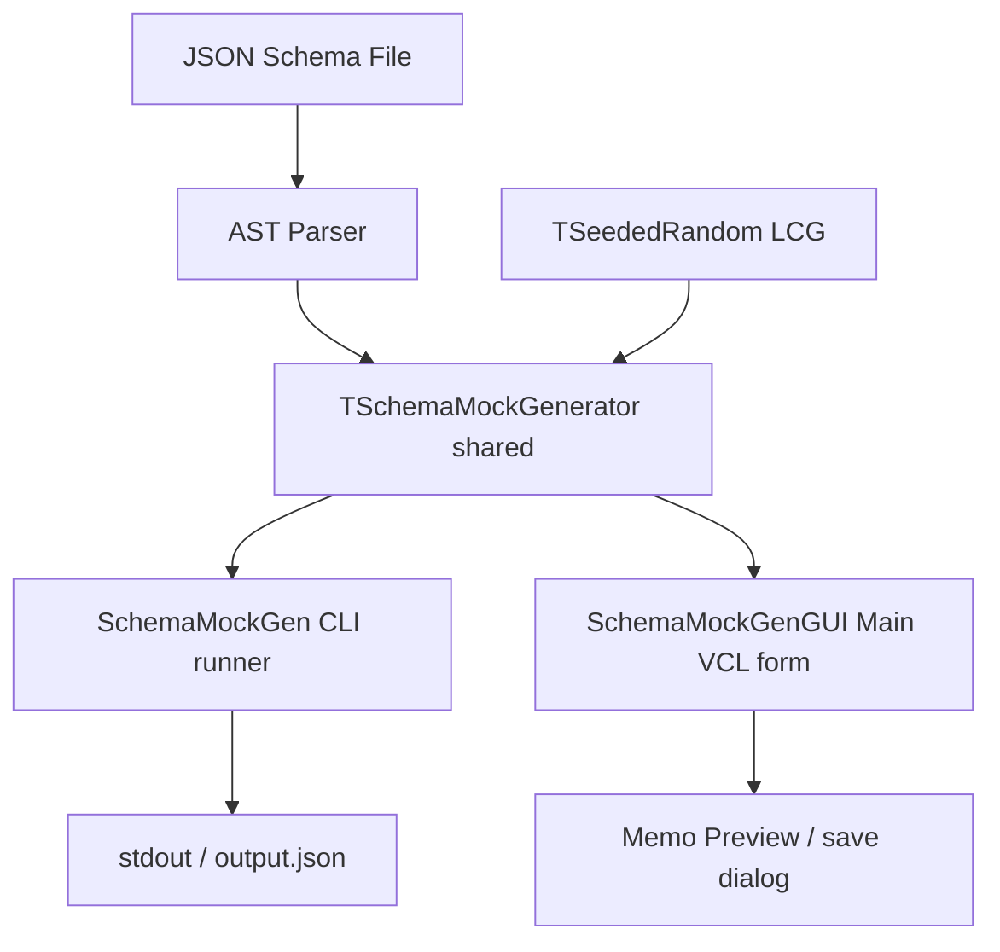

# SchemaMockGen - Architectural Planning

This document describes the component architecture and data flow of `SchemaMockGen`.

## Architectural Overview

`SchemaMockGen` utilizes a shared modular backend architecture. The core random LCG generator and JSON Schema walking engine reside in the shared `src/` directory. Both the console program (`SchemaMockGen.dpr`) and the VCL application (`SchemaMockGenGUI.dpr`) reference the same backend generator.

## Component Flow Diagram

## Module Breakdown

### 1. Seeded Random Generator (`SchemaMockGen.Utils.pas`)

- Implements `TSeededRandom`, a Linear Congruential Generator (LCG) using Knuth's parameters.
- Guarantees that the same seed value yields identical pseudo-random sequences regardless of operating system or compiler.
- Implements file reading and writing utilities.

### 2. Code Generation Engine (`SchemaMockGen.Generator.pas`)

- Implements `TSchemaMockGenerator`.
- Recursively traverses the JSON schema AST using `GenerateFromSchema`.
- Evaluates constraints (ranges, string bounds, regex, enum/const, objects/arrays) and creates corresponding `TJSONValue` structures.

### 3. CLI Orchestrator (`SchemaMockGen.Runner.pas`) & Program

- Coordinates CLI arguments from `SchemaMockGen.Config.pas`.
- Manages output writing and exits with code `0` on success or `2` on errors.

### 4. VCL GUI App (`SchemaMockGenGUI.Main.pas` & `Main.dfm`)

- Visual form linking browse dialogs, parameter edits, and Memo output components.
- Invokes `TSchemaMockGenerator` dynamically on button clicks and writes generated JSON payloads directly to the preview memo.
