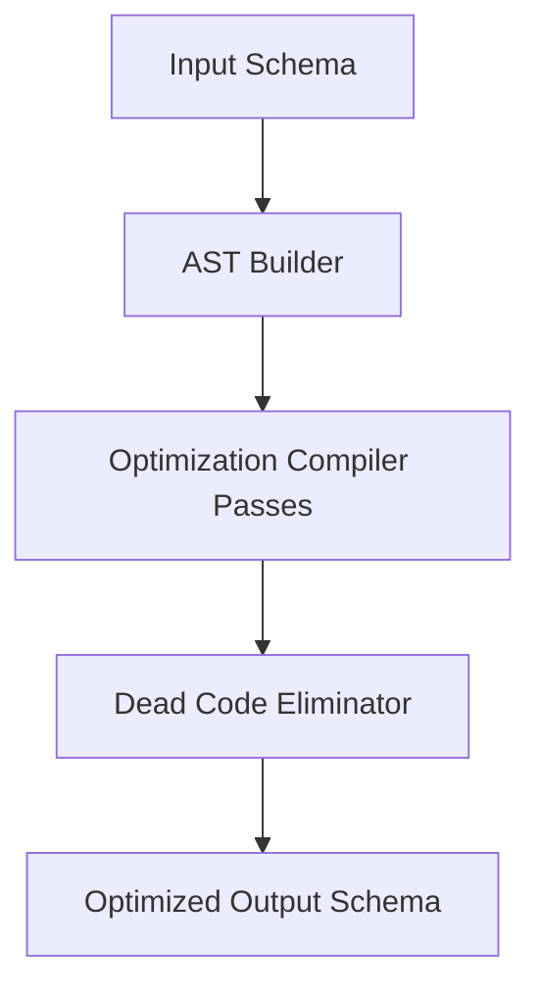

# SchemaOptimizer - Architectural Planning

## Overview

`SchemaOptimizer` runs code-optimization-like passes on a JSON Schema AST to reduce payload size and speed up validation execution.

## Component Architecture

### 1. Optimization Passes
- **Combinator Merge Pass**: Recursively flattens nested `allOf` arrays into a single level.
- **Redundancy Elimination**: If a field has `type: string` and is also constrained by a subschema with `type: string`, merges the constraint.
- **Pruning**: Deletes unused schemas in definitions that have no incoming `$ref` paths.
