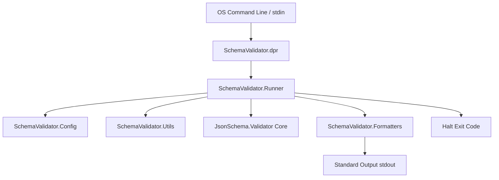

# SchemaValidator - Component Architecture

This document describes the internal structure, dependencies, and execution flow of the `SchemaValidator` utility.

## Architectural Overview

`SchemaValidator` is designed with modularity, testability, and separation of concerns in mind. Instead of writing all CLI logic in a single monolithic `.dpr` file, the tool is split into multiple lightweight Pascal units located in the `src/` directory.

## Execution Flow Diagram

## Component Breakdown

### 1. Main Entry Point (`SchemaValidator.dpr`)

- Located at the tool root.
- Very thin wrapper; its only responsibility is calling `RunSchemaValidator` from the Runner module and catching any unhandled exceptions to return exit code 2.

### 2. Configuration Parser (`SchemaValidator.Config.pas`)

- Declares the `TConfig` record representing all configurable settings.
- Implements `ParseArguments` to read standard command-line parameters.
- Implements `ParseArgumentsEx(const pArgs: TArray<string>)` to allow the test suite to pass mock argument arrays for full unit-test coverage.

### 3. Utility Helpers (`SchemaValidator.Utils.pas`)

- **File Reader**: Reads UTF-8 encoded files safely into a string.
- **Stdin Reader**: Reads piped content dynamically until EOF is reached.
- **Draft Detector**: Scans the JSON schema object for the `$schema` keyword to automatically match it to the correct `TDraftVersion` dialect.

### 4. Output Formatters (`SchemaValidator.Formatters.pas`)

- Separates formatting concerns from the main runner.
- **Text Format**: Prints human-readable localized summaries of validation outcomes.
- **JSON Format**: Prints a serialized JSON array representing validation errors (empty path placeholders are output as the validation engine evolves).
- **JUnit XML Format**: Generates standard XML tags containing testcases and failures to seamlessly integrate into CI pipeline reports.

### 5. Orchestrator Runner (`SchemaValidator.Runner.pas`)

- The brain of the CLI.
- Coordinates the parsing of arguments, file/stdin reads, and instantiation of `TJsonSchemaValidator`.
- Applies the formatting configurations and returns the appropriate exit code (0: Success, 1: Invalid document, 2: Parsing/Runtime error).
