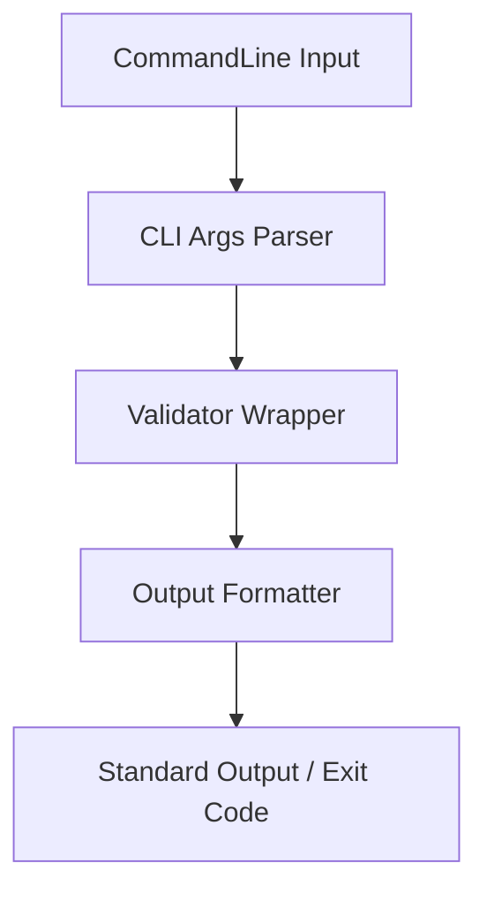

# SchemaValidatorCLI - Architectural Planning

## Overview

`SchemaValidatorCLI` is a console wrapper around the `TJsonSchemaValidator` library. It exposes schema validation functionality to script environments and CI/CD pipelines.

## Component Architecture

### 1. CLI Arguments Parser
- Parses input options (e.g., `-s schema.json`, `-i data.json`, `--draft 2020-12`, `--format-json`).

### 2. Core Validator Wrapper
- Instantiates the Delphi `TJsonSchemaValidator`.
- Configures validation options (`EnforceFormats`, `Locale`).
- Executes the validation and captures the aggregated `IValidationResult`.

### 3. Output Formatter
- Formats error structures for stdout (Console, JSON, JUnit XML).
