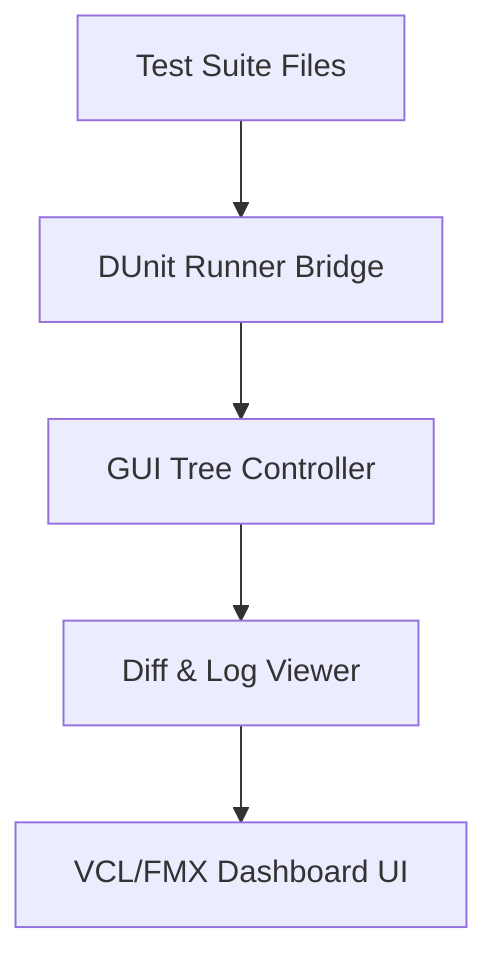

# VisualTestSuiteRunner - Architectural Planning

## Overview

`VisualTestSuiteRunner` provides a GUI interface to run and analyze the official JSON Schema compliance tests inside Delphi.

## Component Architecture

### 1. Test Suite Bridge
- Reads official JSON Schema test fixtures (`test/schemas/`).
- Runs them dynamically using the Delphi validator engine and logs outcomes.

### 2. GUI Controller
- Populates tree views representing tests.
- Updates node colors (Green/Red) in real-time.
- Displays the raw schema and validation failures side-by-side.
